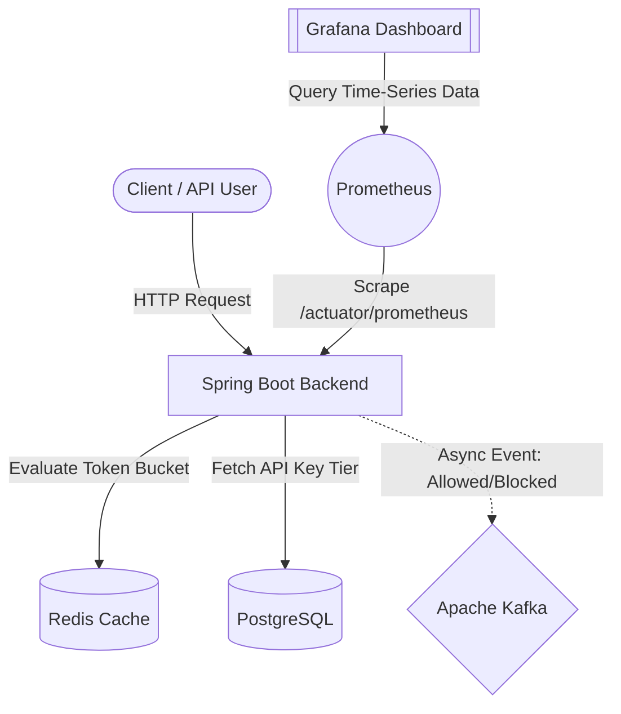

# 🛡️ Distributed API Rate Limiter


A high-performance, containerized microservice engineered to manage API traffic, prevent abuse, and ensure high availability in distributed systems. Built with a focus on low-latency decision-making, asynchronous auditing, and real-time observability.

## ✨ Key Features

* **High-Throughput Rate Limiting:** Implements the Token Bucket algorithm via Redis to ensure sub-millisecond latency for traffic evaluation.
* **Asynchronous Audit Logging:** Offloads blocked/allowed request auditing to Apache Kafka, decoupling analytics from the critical request path.
* **Persistent Tier Management:** Uses PostgreSQL to manage dynamic client API keys and varying rate-limit tiers.
* **Live Telemetry & Alerting:** Exposes custom Micrometer metrics scraped by Prometheus and visualized in real-time on a Grafana dashboard.
* **Fully Containerized:** Entire stack is orchestrated via a single Docker Compose network for instant local deployment.

## 🏗️ System Architecture



## 🚀 Quick Start

### Prerequisites
* [Docker](https://www.docker.com/products/docker-desktop) and Docker Compose installed.
* Ports `8080`, `3000`, `9090`, `5432`, `6379`, and `9092` must be available on your host machine.

### 1. Clone the Repository
```bash
git clone [https://github.com/AyushSinha2603/rate-limiter.git](https://github.com/AyushSinha2603/rate-limiter.git)
cd rate-limiter
```

### 2. Configure Environment
Create a `.env` file in the root directory (or simply rely on the default fallbacks for local testing):
```env
# Database Configuration
POSTGRES_USER=postgres
POSTGRES_PASSWORD=postgres
POSTGRES_DB=ratelimiter_db

# Grafana Configuration
GF_SECURITY_ADMIN_USER=admin
GF_SECURITY_ADMIN_PASSWORD=admin
```

### 3. Spin Up the Infrastructure
Run the following command to build the Java application and boot up the entire distributed cluster:
```bash
docker compose up -d --build
```

## 📊 Observability & Monitoring

Once the cluster is running, the observability stack automatically begins tracking traffic and system health.

* **Grafana Dashboard:** `http://localhost:3000` (Login: `admin` / `admin`)
* **Prometheus Targets:** `http://localhost:9090/targets`
* **Actuator Endpoint:** `http://localhost:8080/actuator/prometheus`

**Key Metrics Tracked:**
* `rate_limiter_requests_total`: Tracks overall throughput. Filter by the `result` label (`allowed` or `blocked`) to monitor traffic health and limit breaches in real-time.

## 🔌 API Usage Examples

**Test the Rate Limiter (Allowed Request):**
```bash
curl -X GET http://localhost:8080/api/resource \
     -H "X-API-KEY: free_token_123"
```

**Test the Rate Limiter (Blocked Request - 429 Too Many Requests):**
*Run this loop to exhaust the token bucket and trigger a block.*
```bash
for i in {1..20}; do curl -i http://localhost:8080/api/resource -H "X-API-KEY: free_token_123"; done
```

## 🛠️ Development

To run the Spring Boot application locally outside of Docker (while keeping the database and message broker containerized):

1. Start only the infrastructure services:
   ```bash
   docker compose up -d postgres redis kafka prometheus grafana
   ```
2. Run the Spring Boot application via your IDE or Maven:
   ```bash
   ./mvnw spring-boot:run
   ```