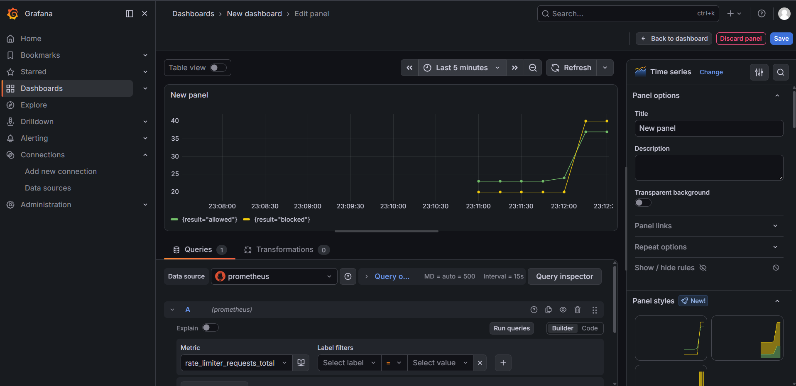
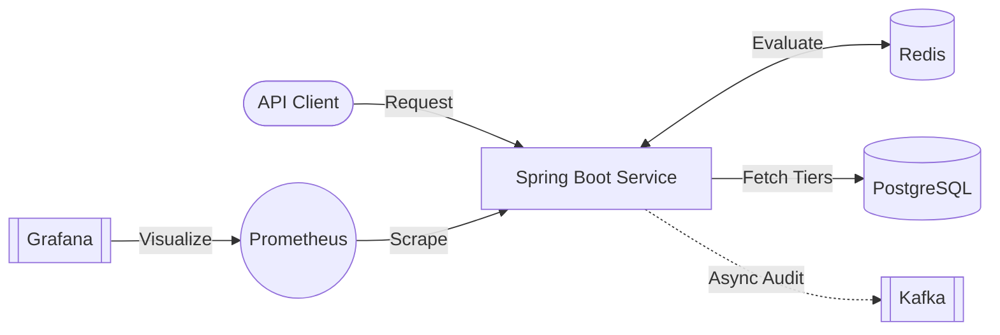
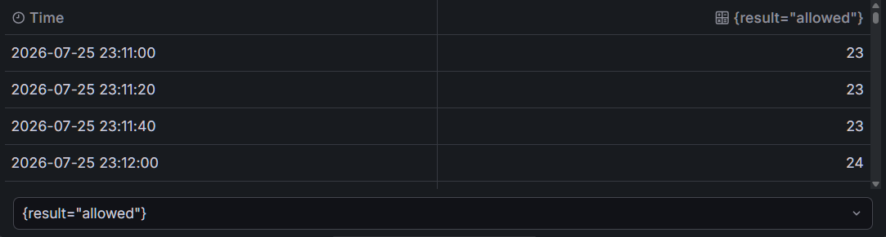

# 🛡️ Distributed API Rate Limiter

A robust, high-performance microservice designed to control API traffic and prevent abuse across distributed systems.

Built with Java and Spring Boot, this service utilizes Redis for sub-millisecond evaluation of requests via the Token Bucket algorithm. It dynamically enforces tiered rate limits managed in PostgreSQL, while asynchronously streaming audit logs to Apache Kafka to ensure the critical request path remains unblocked. Full system telemetry is exposed to Prometheus and Grafana for real-time traffic observability.

<p align="center">
  
</p>
<p align="center"><em>Real-time traffic visibility and limit tracking through Grafana.</em></p>

---

## 🏗️ Architecture Overview

The system is designed for high availability and low latency. The primary bottleneck in rate limiting is often the database or the logging mechanism. To solve this:
1. **Traffic Evaluation:** Redis is used as a high-speed centralized state store for the Token Bucket algorithm, allowing multiple instances of the rate limiter to act in unison.
2. **Audit Logging:** Instead of writing to a database on every request, results are published to an Apache Kafka topic. This decouples the analytics workload from the request handling workload.



## ✨ Core Capabilities

- **⚡ Sub-Millisecond Latency:** Redis-backed token bucket ensures minimal overhead on incoming API requests.
- **🌊 Event-Driven Auditing:** Kafka integration allows for scalable, non-blocking storage of request history (allowed vs. blocked).
- **🔐 Tiered Access:** PostgreSQL stores client API keys mapped to different rate limit tiers (e.g., Free, Pro, Enterprise).
- **📊 Out-of-the-box Monitoring:** Integrated Micrometer metrics provide deep visibility into system health and traffic patterns.

<p align="center">
  
</p>
<p align="center"><em>Asynchronous audit logging capturing request outcomes.</em></p>

## ⚙️ Rate Limiting Mechanism

The application utilizes the **Token Bucket** algorithm, implemented via Redis atomic operations, to guarantee fast and safe evaluations even under heavy load across distributed nodes.

- **Tokens:** Represent allowed requests.
- **Bucket Capacity:** The maximum burst of requests a client can make.
- **Refill Rate:** The constant rate at which tokens are replenished, dictating the sustained rate limit.

By storing the buckets in Redis, the system avoids race conditions and ensures synchronization across any number of stateless Spring Boot API instances.

## 📂 Project Structure

```text
├── src/main/java/.../ratelimiter/
│   ├── config/      # Redis, Kafka, and System configurations
│   ├── controller/  # API endpoints for traffic and admin ops
│   ├── filter/      # Intercepts incoming requests for evaluation
│   ├── model/       # Entities (ClientTier, ApiKey, AuditLog)
│   ├── repository/  # Spring Data JPA repositories
│   └── service/     # Token bucket logic, tier fetching, Kafka publishing
├── docker-compose.yml   # Infrastructure orchestration
├── Dockerfile           # Spring Boot containerization
└── README.md
```

## 🛠️ Tech Stack

- **Application:** Java 17, Spring Boot 3
- **Data & State:** Redis, PostgreSQL
- **Event Streaming:** Apache Kafka
- **Observability:** Prometheus, Grafana, Micrometer
- **Deployment:** Docker, Docker Compose

---

## 🚀 Quick Start Guide

### Prerequisites
- Docker and Docker Compose
- Available ports: `8080` (API), `3000` (Grafana), `9090` (Prometheus), `5432` (Postgres), `6379` (Redis), `9092` (Kafka)

### 1. Setup

Clone the project repository:
```bash
git clone https://github.com/AyushSinha2603/rate-limiter.git
cd rate-limiter
```

Optional: Define custom credentials in a `.env` file at the root. Otherwise, default values will be used.
```env
POSTGRES_USER=postgres
POSTGRES_PASSWORD=postgres
POSTGRES_DB=ratelimiter_db
GF_SECURITY_ADMIN_USER=admin
GF_SECURITY_ADMIN_PASSWORD=admin
```

### 2. Launch

Start the entire distributed cluster using Docker Compose:
```bash
docker compose up -d --build
```

---

## 💻 Usage Example

**Successful Request (Allowed):**
```bash
curl -X GET http://localhost:8080/api/resource \
     -H "X-API-KEY: free_token_123"
```

**Throttled Request (Blocked - 429 Too Many Requests):**
Run this loop to exhaust the client's token bucket:
```bash
for i in {1..20}; do curl -i http://localhost:8080/api/resource -H "X-API-KEY: free_token_123"; done
```

---

## 📈 Telemetry & Monitoring

Live system metrics are available immediately upon startup.

- **Grafana:** `http://localhost:3000` (Default credentials: `admin` / `admin`)
- **Prometheus:** `http://localhost:9090/targets`

The dashboard tracks the `rate_limiter_requests_total` metric, allowing you to filter by the `result` tag (`allowed` or `blocked`) to visualize traffic patterns and identify potential abuse in real-time.

---

## 🧑‍💻 Local Development

To develop the Spring Boot application locally while utilizing Docker for the backing infrastructure:

1. Bring up only the supporting services:
   ```bash
   docker compose up -d postgres redis kafka prometheus grafana
   ```
2. Start the application natively:
   ```bash
   ./mvnw spring-boot:run
   ```